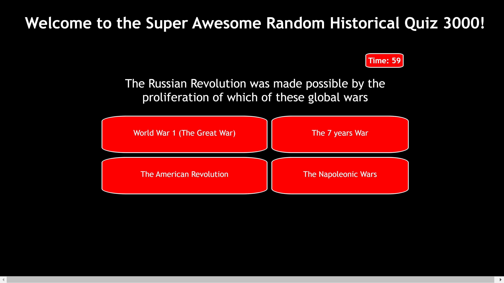
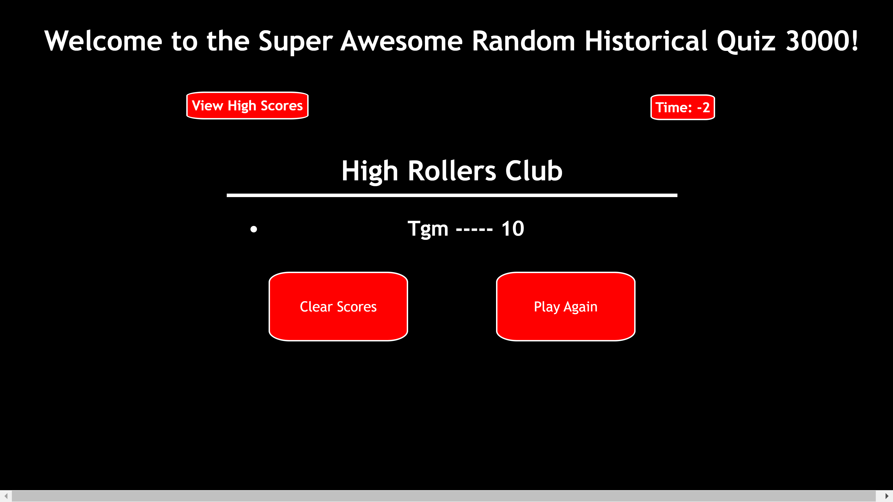

# Javasript-Quiz
This is a histoy quiz based out of using native Java Script. 

## Installation
No installation required. Simply go to this website https://lordgeer.github.io/Javasript-Quiz/, read the instructions and then press start! 

##

## Usage

Start begins the game for 7 questions with a 60 second countdown. Each question is worth 10 points for a maximum total of 70. Each wrong answer takes 10 seconds from the timer. When either the timer runs out or all questions are answered, the game is over. Your score will then be displayed and you can imput your initals for the leaderboard. After imputting your initatls, you will be shown the leaderboard with an option to clear scores or to play again. 

## Contributing
Pull requests are welcome. For major changes, please open an issue first to discuss what you would like to change.

## License
[MIT](https://choosealicense.com/licenses/mit/)